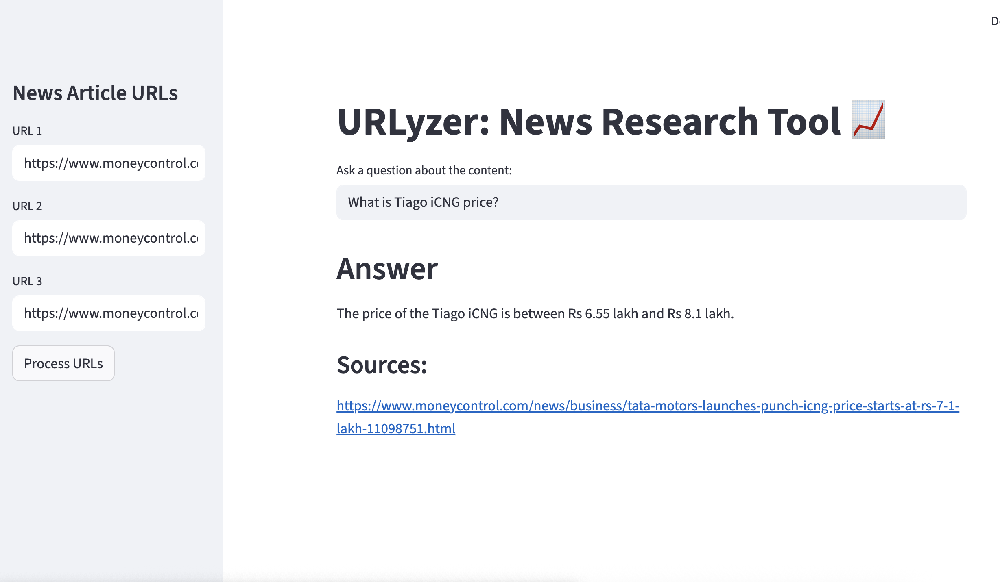

# RockyBot: News Research Tool

**RockyBot** is a user-friendly news research tool built with LangChain and Streamlit. It allows you to fetch financial news content from URLs, embed them using OpenAI, store them in FAISS for efficient retrieval, and query insights via LLMs.

---

## Features

- Load article URLs via sidebar or upload `.txt` file with URLs.
- Fetch and process article content using `UnstructuredURLLoader`.
- Convert content into OpenAI embeddings and store with `FAISS`.
- Ask questions and retrieve source-backed answers from indexed content.
- Local FAISS index persistence for future querying.

---

## Project Structure

```
news_research_tool/
│
├── assets/
│   └── URLyzer.png                 # Optional assets like logos or visuals
│
├── faiss_index/                    # Directory storing FAISS index files
│
├── notebook/                       # Jupyter notebooks for prototyping (if any)
│
├── venv/                           # Virtual environment (excluded from version control)
│
├── .env                            # Environment file storing API keys
├── main.py                         # Streamlit app main script
├── requirements.txt                # Python dependencies
└── README.md                       # Project documentation
```

---

## Installation

1. Clone the Repository:

```bash
git clone https://github.com/your-username/news_research_tool.git
cd news_research_tool
```

2. Install Dependencies:

```bash
pip install -r requirements.txt
```

3. Add OpenAI Key:

Create a `.env` file in the root directory:

```
OPENAI_API_KEY=your_openai_api_key_here
```

---

## Usage

1. Run the Streamlit App:

```bash
streamlit run main.py
```

2. Using the App:

- Add article URLs via sidebar input or upload a `.txt` file.
- Click "Process URLs" to:
  - Load and clean content
  - Generate OpenAI embeddings
  - Store and index data using FAISS
- Ask questions in the query box.
- Get answers with reference sources in real-time.

---

## Example URLs to Test

```
https://www.moneycontrol.com/news/business/tata-motors-mahindra-gain-certificates-for-production-linked-payouts-11281691.html
https://www.moneycontrol.com/news/business/tata-motors-launches-punch-icng-price-starts-at-rs-7-1-lakh-11098751.html
https://www.moneycontrol.com/news/business/stocks/buy-tata-motors-target-of-rs-743-kr-choksey-11080811.html
```

---

## Dependencies

See [`requirements.txt`](./requirements.txt) for full list.

```
streamlit
langchain
langchain-community
langchain-openai
unstructured
python-dotenv
openai
faiss-cpu
tqdm
```

---

## Notes

- Your FAISS index is saved in the `faiss_index/` directory for persistent storage.
- You can customize the model or loader within `main.py`.

---

## UI Preview



---

## Acknowledgments

- Built using LangChain, OpenAI API, and Streamlit
- Inspired by real-world financial use cases
